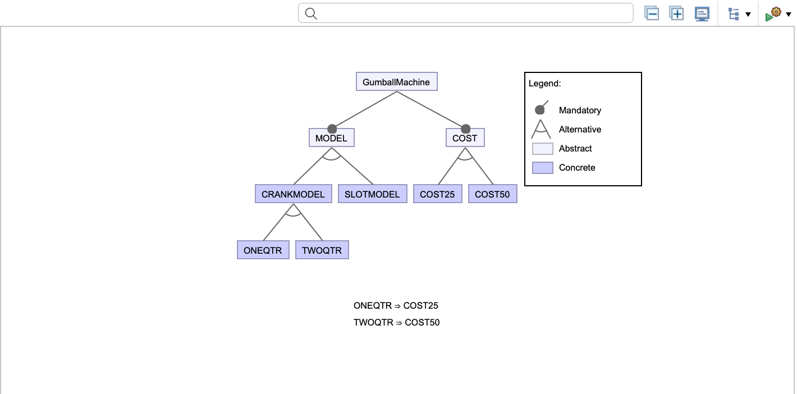

# Summary
### Using AspectJ, we can easily change the configuration of Gumball machine. We just have to change .config file in order to run different configurations. The code is also shorter for adding new configurations. You just need to code a new component and add it in feature diagram. Then you just need to select it in .config file in order to run at run time.

4 possible configuration:
- Crank/Slot
- 25 Cent/ 50 Cent

, (25cent/50cent)" )

Feature Diagram

Crank machine model for 25 cent

Slot machine model for 25 cent

Crank machine model for 50 cent

Slot machine model for 50 cent

